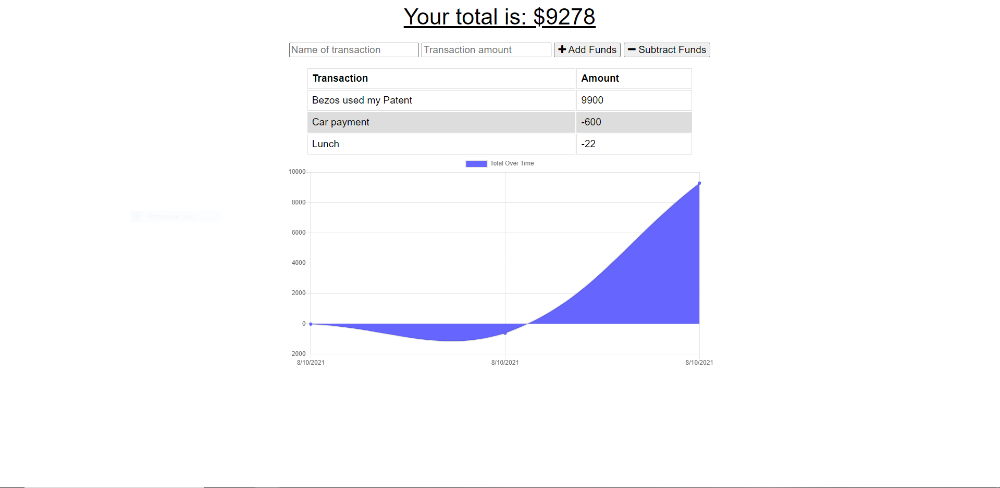

# Dwarven PWA Budget Tracker

[](https://github.com/SamuelMontague/workoutTracker)
  
#Description

PWA allows to run the application both online and offline, doing this would allow you to use the web application, even if you dont have an internet connection. The budget tracker allows you to deposit and withdrawl money based on your spending, allowing you to title each transaction with any name.

 
    
# Table of Contents

* [Installation](#installation)
    
* [Usage](#usage)

* [License](#license)

* [Contributing](#contributing)

* [Technology](#Technology)

* [Questions](#questions)
    
# Installation
Clone the repo to your local machine.

Run ```npm install``` to install dependencies.

Run ```npm start``` to start the application.

# Usage

Enter a title for your recent transaction.
Enter a monetary value for the transaction. 
Decide whether the transaction is an increment or a decrement towards your spending. 
Check the graph to see your overall spending and transaction history.
Open the dev console on google chrome and select "offline" in the network tab. 

# License

This application is covered by the MIT license.
    
# Contributing

Contributors: Samuel Montague

# Technology

MongoDB 
    - used to host the data. Built for modern application developers.

Mongoose
    - Mongoose uses MongoDB for object modeling.
    - Is a schema based solution to model your app data.

Express
    -  Express is a minimal and flexible Node.js application.

Google Chrome 
    - Chrome is used for its indepth developer console.


    
# Questions

If you have any questions about the repo, open an issue or contact me directly at SamuelpMontague@gmail.com. You can find more of my work at (https://github.com/SamuelMontague/).